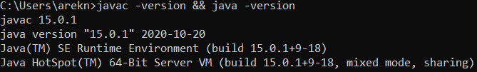
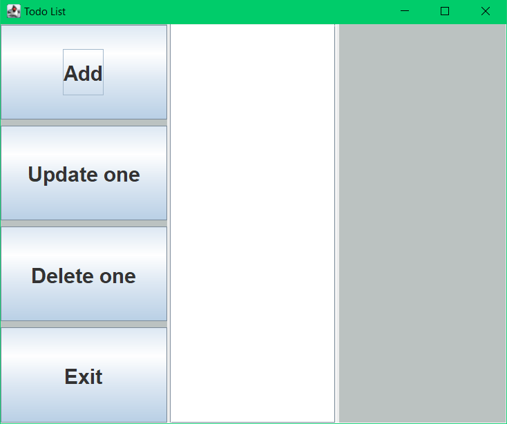
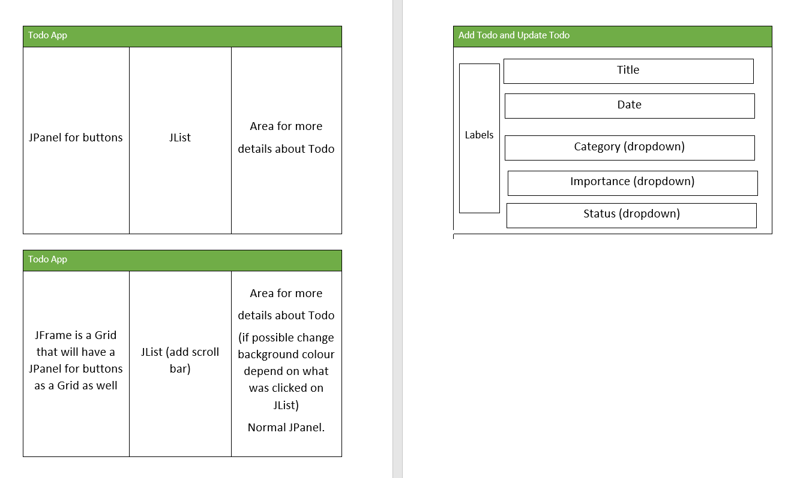

# ToDo-App 

**&raquo; An object-oriented ToDo application** <br/><sub> _100% Java_ &middot; _Java Swing_ &middot; _JAR file_</sub>

---

## What is ToDo-App

ToDo-APP is a simple todo desktop list application. The initial version was being navigated with the use of command line interface. However, the extension has required to provided a GUI for the application. The format of the interface and code changes in relation to the application were limitless. The only requirement was to create the initial design wire frame by which the development is concluded. 

#### Contents

- **[1 Getting ToDo-App](#1-getting-todo-app)**
  - [1.1 Check if ToDo-App can be executed](#11-check-if-todo-app-can-be-executed)
  - [1.2 Execute code in terminal](#12-execute-code-in-terminal)
  - [1.2 Execute JAR file in terminal](#13-execute-jar-file-in-terminal)
- **[2 About the program](#2-about-the-program)**
  - [2.1 Available options](#22-available-options)
  - [2.2 Wireframe](#22-wireframe)

## 1 Getting ToDo-APP

### 1.1 Check if ToDo-APP can be executed

To run the ToDo-APP you need to have installed [JDK](https://www.oracle.com/java/technologies/downloads/) on your machine.
The version of the JDK to execute this program can start from version _11.0_, however, we encourage to use versions above if necessary.
Check if you have the JDK installed by opening a terminal and typing :

```bash
javac -version
java -version
```

or

```bash
java -version && javac -version
```

In case where a version was given back by the terminal you can execute the code. You should get something similar to the one above except your version might be _11.0_ or above.



### 1.2 Execute code in terminal

To execute the code in the terminal, simply navigate to the downloaded folder where the "Main.class" and "Main.java" files are located. Next, copy the path address. Once this is done, open a terminal and type the following command:

```bash
cd "path/address/you/have/copied"
```

confirm with "Enter" and type :

```bash
javac Main.java
java Main
```

On successful completion of going through these steps, you should be able to view the result below :



_**<sub>If this has not worked check Windows JDK installation guide [Tutorial Windows](https://www.youtube.com/watch?v=xS8cCAyTANs&t=1s)!</sub>**_

_**<sub> Alternatively try Mac OS installation guide [Tutorial Mac OS](https://www.youtube.com/watch?v=54qu9Su2Gos&t=3s)!</sub>**_

### 1.3 Execute JAR file in terminal
An alternative option is to simply run JAR file located in the filepath:
```bash
ToDo-App/out/artifacts/part_3_jar/
```
where the JAR file is located at "part3.jar". It is important to note that the JDK configuration must be set up according to the guide or correspond to the current configuration at the time of reading this documentation. Nevertheless, the best options is to run simple command in our terminal:

```bash
cd "path/address/you/have/copied/that/goes/to/jar/file/location"
```
```bash
java -jar part3.jar
```
Upon successful completion, the ToDo-App should be displayed without any error messages.

_**<sub>If this has not worked check Packaging the Application tutorial. You might have to redo this process. [Tutorial IntelliJ IDE](https://www.jetbrains.com/idea/guide/tutorials/hello-world/packaging-the-application/)!</sub>**_

<sub>[[Top 🢁](#contents)]</sub>

## 2 About the program
### 2.1 Available options
The app offers a range of functionalities, empowering users to:

1. Add a New ToDo Note: Users can effortlessly create a new todo note by providing essential details such as title, due date, category, importance, and status. This allows for comprehensive task management and organization.

2. Update ToDo Details: Users have the flexibility to update specific todos from the list. They can modify any previously mentioned details, such as the title, due date, category, importance, or status. After making the necessary changes, users can choose to save or discard the updates.

3. Delete ToDo Entries: Deleting unwanted todos is made easy through the app's intuitive interface. By selecting a specific todo from the list and utilizing the "Delete one" function, users can seamlessly remove unwanted tasks from their list, streamlining their task management process.

4. Exit the App: To conclude their session, users can effortlessly exit the app. This allows for a seamless and convenient user experience.

These user-friendly features empower users to effectively manage their todos, providing them with control and flexibility in organizing their tasks.

The interface consists of a comprehensive panel located on the left-hand side, encompassing all available options, while the center of the interface houses the task list. Furthermore, the right-hand side panel dynamically showcases the pertinent details and color-coded representation of the currently selected todo, based on its corresponding category.

### 2.2 Wireframe


The project aligns with the pre-established wireframe, which served as the initial step of the project. Subsequently, the development progressed in accordance with the defined parameters outlined in the guidance file provided below.

<embed src="https://github.com/ArkadiusN/ToDo-App/blob/master/coursework3.pdf" type="application/pdf">

<sub>[[Top 🢁](#contents)]</sub>
